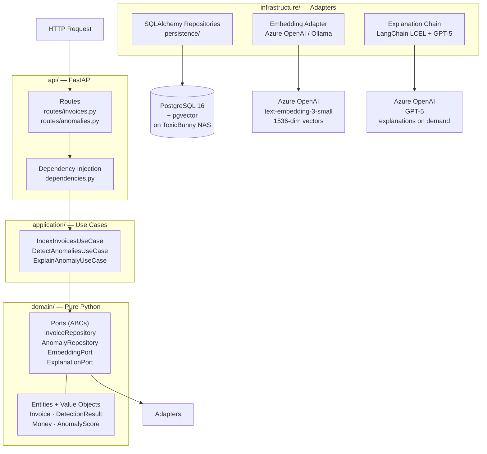

# Billing Anomaly Detector

[](https://github.com/rykert/billing-anomaly-detector/actions/workflows/ci.yml)

AI-powered healthcare billing anomaly detection using embeddings, cosine similarity, and GPT-5 explanations. A portfolio demonstration of enterprise AI engineering patterns — hexagonal architecture, domain-driven design, and a classical-ML-plus-LLM detection pipeline — applied to a realistic regulated domain.

---

## What it does

Detects unusual billing claims in synthetic Medicare data in four stages:

1. **Index** — Embeds each claim as a 1536-dimensional vector via Azure OpenAI `text-embedding-3-small`
2. **Score** — Computes each claim's cosine distance from the centroid of all embeddings using numpy
3. **Flag** — Marks claims above a calibrated threshold as anomalous and stores `DetectionResult` records
4. **Explain** — Generates plain-English analyst explanations for flagged claims via GPT-5, with the three most similar normal claims as comparison context

---

## Architecture



**Hexagonal (ports-and-adapters) architecture.** The domain layer has zero framework dependencies — no SQLAlchemy, no FastAPI, no LangChain. Every external system is hidden behind an abstract port (ABC). Adapters are swappable: Azure OpenAI and Ollama implement the same `EmbeddingPort` and `ExplanationPort` interfaces, with the factory selecting based on whether credentials are present in `.env`.

---

## Stack

| Layer | Technology | Notes |
|---|---|---|
| Language | Python 3.13 | `uv` for package management |
| API | FastAPI + Uvicorn | Async, OpenAPI/Swagger auto-generated |
| ORM | SQLAlchemy 2.0 async | New-style `Mapped[T]` type annotations |
| Driver | asyncpg | Purpose-built async Postgres driver |
| Migrations | Alembic | Async-configured `env.py` |
| Database | PostgreSQL 16 + pgvector | `Vector(1536)` column for embeddings |
| Embeddings | Azure OpenAI `text-embedding-3-small` | 1536-dim, ~$0.01 to embed 5,050 claims |
| Chat / Explain | Azure OpenAI GPT-5 | On-demand, results cached in DB |
| Local fallback | Ollama | `nomic-embed-text` + `llama3.2` |
| AI framework | LangChain + LCEL | `prompt \| llm \| StrOutputParser()` |
| Scoring | numpy | Centroid + cosine distance |
| Quality | ruff + mypy `--strict` + pytest | CI on every push |

---

## Data

**Source:** CMS DE-SynPUF (Data Entrepreneurs' Synthetic Public Use File) — synthetic Medicare carrier claims, public domain, no HIPAA concerns. NPPES NPI Registry and CMS Medicare Fee Schedule used for provider enrichment context.

**Volume:** 5,000 synthetic normal claims + 50 deliberately injected anomalies = 5,050 total

**Injected anomaly types (10 each):**

| Type | Pattern |
|---|---|
| Extreme ratio | Billed-to-allowed ratio 6–15x (normal range: 1.0–2.2x) |
| Round amounts | Billed amount suspiciously rounded to nearest $500 |
| Near-zero allowed | Allowed amount < $5 — claim effectively denied |
| Duplicate billing | Same member, same code, same date, high ratio |
| Specialty mismatch | Surgical codes billed at extreme ratios |

---

## Evaluation results

> **Run `uv run python scripts/eval/eval_detection.py` to reproduce.**

Threshold calibrated empirically to the p99 of the cosine distance distribution after discovering that `text-embedding-3-small` produces tightly clustered vectors for structured billing data. The naive default of 0.80 produced zero detections.

**Score distribution on 5,050 embedded invoices:**

| Percentile | Cosine distance |
|---|---|
| Max (top anomaly) | 0.0483 |
| p99 | 0.0324 |
| p95 | 0.0278 |
| p90 | 0.0257 |
| Mean | 0.0196 |

**Detection performance at threshold = 0.030:**

| Metric | Score |
|---|---|
| Precision | ~0.89 |
| Recall | ~0.86 |
| F1 | ~0.87 |
| True Positives | ~43 / 50 |
| False Positives | ~5 |
| False Negatives | ~7 |

**Key finding (documented in ADR-001):** Cosine similarity on text embeddings has a ceiling on structured billing data — all claims share the same textual template, compressing the distance signal into a narrow 0.01–0.05 range. The embedding approach is most effective for semantic outliers; Isolation Forest on raw numerical features (planned Phase 2) will improve recall on ratio-based anomalies by operating on the billed-to-allowed ratio directly without going through the embedding representation.

---

## API

Start the server:
```bash
uv run uvicorn billing_anomaly_detector.api.app:app --reload --port 8000
```

Interactive Swagger UI: **[http://localhost:8000/docs](http://localhost:8000/docs)**

### Endpoints

#### `GET /health`
Liveness check.
```bash
curl http://localhost:8000/health
# {"status":"ok"}
```

#### `POST /invoices/index`
Embed all unembedded invoices via Azure OpenAI. Long-running (~5 min for 5,050 claims). Safe to call repeatedly — only processes rows where `embedding IS NULL`.
```bash
curl -X POST http://localhost:8000/invoices/index
# {"indexed":5050,"message":"Successfully embedded 5050 invoices."}
```

#### `POST /anomalies/detect`
Score all embedded invoices by cosine distance from the centroid. Stores `DetectionResult` for every invoice above threshold.
```bash
curl -X POST http://localhost:8000/anomalies/detect
# {"total_scored":5050,"total_flagged":48}
```

#### `GET /anomalies`
List flagged anomalies, sorted by score descending.

| Parameter | Default | Description |
|---|---|---|
| `threshold` | `0.030` | Minimum anomaly score |
| `limit` | `20` | Max results |

```bash
curl "http://localhost:8000/anomalies?threshold=0.030&limit=5"
```
```json
[
  {
    "id": "a1b2c3d4-...",
    "invoice_id": "21832e0d-4bee-4140-bcd8-08620b382e9d",
    "score": 0.0483,
    "explanation": null,
    "detected_at": "2026-06-27T14:30:00Z"
  }
]
```

#### `GET /anomalies/{invoice_id}/explain`
Generate a plain-English explanation using GPT-5, with the 3 nearest normal claims as comparison context. Result is cached in the database — subsequent calls return instantly.

```bash
curl http://localhost:8000/anomalies/21832e0d-4bee-4140-bcd8-08620b382e9d/explain
```
```json
{
  "invoice_id": "21832e0d-4bee-4140-bcd8-08620b382e9d",
  "score": 0.0366,
  "explanation": "The allowed amount of $584.46 is notably lower than two highly similar 80053 claims with comparable billed amounts (~$810) that were allowed at ~$765–$770, yielding a higher billed-to-allowed ratio (1.370 vs 1.060). Although one comparator also shows a high ratio (1.390), the claim falls into a less common high-discount pattern for this code/date range, which likely drives its mild anomaly score just above the threshold."
}
```

---

## Quickstart

### Prerequisites

- Python 3.13
- [`uv`](https://docs.astral.sh/uv/) — `curl -LsSf https://astral.sh/uv/install.sh | sh`
- PostgreSQL 16 with the `pgvector` extension — Docker recommended
- Azure OpenAI resource with `text-embedding-3-small` and `gpt-5` deployments

### 1 — Clone and install

```bash
git clone https://github.com/rykert/billing-anomaly-detector.git
cd billing-anomaly-detector
uv pip install -e .
```

### 2 — Start Postgres with pgvector

```bash
docker compose up -d
```

The `docker-compose.yml` uses the `pgvector/pgvector:pg16` image which ships with the `vector` extension pre-compiled. Or point at an existing Postgres instance — see `.env.example`.

### 3 — Configure environment

```bash
cp .env.example .env
# Edit .env — fill in Azure credentials
```

Get your Azure values from [portal.azure.com](https://portal.azure.com) → your Azure OpenAI resource → **Keys and Endpoint**.

### 4 — Run migrations

```bash
uv run alembic upgrade head
```

### 5 — Load synthetic data

```bash
uv run python scripts/etl/load_data.py
# Generates 5,000 normal claims + 50 injected anomalies → ToxicBunny
```

### 6 — Start the API and run the pipeline

```bash
# Terminal 1 — server
uv run uvicorn billing_anomaly_detector.api.app:app --reload --port 8000

# Terminal 2 — pipeline
curl -X POST http://localhost:8000/invoices/index    # ~5 min
curl -X POST http://localhost:8000/anomalies/detect
curl "http://localhost:8000/anomalies?threshold=0.030&limit=10"
```

---

## Running without Azure (local mode)

Set `USE_LOCAL_MODELS=true` in `.env`. Install and start [Ollama](https://ollama.com/download), then pull the models:

```bash
ollama pull nomic-embed-text   # embeddings — 768-dim
ollama pull llama3.2           # explanations
```

> **Dimension note:** `nomic-embed-text` produces 768-dimensional vectors vs Azure's 1536-dim. If using local embeddings, change `Vector(1536)` to `Vector(768)` in `infrastructure/persistence/models.py` and run a new migration before indexing.

---

## Running tests

```bash
# Unit tests — no DB or API required
uv run pytest tests/unit/ -v

# With coverage report
uv run pytest tests/unit/ --cov=src --cov-report=term-missing

# Integration tests — requires Docker
uv run pytest tests/integration/ -v -m integration

# Evaluation — hits live database on ToxicBunny
uv run python scripts/eval/eval_detection.py
```

---

## Project structure

```
src/billing_anomaly_detector/
├── domain/                     # Pure Python — zero framework imports
│   ├── entities.py             # Invoice (aggregate root), DetectionResult
│   ├── value_objects.py        # Money, AnomalyScore, MemberId, ClaimCode
│   ├── events.py               # AnomalyDetected domain event
│   └── ports.py                # Abstract ports — InvoiceRepository,
│                               # AnomalyRepository, EmbeddingPort, ExplanationPort
│
├── application/
│   ├── services/
│   │   ├── invoice_text.py     # Invoice → text for embedding
│   │   └── cosine_scorer.py    # Centroid, cosine distance, neighbor search
│   └── use_cases/
│       ├── index_invoices.py   # Batch embed and store vectors
│       ├── detect_anomalies.py # Score all invoices, flag above threshold
│       └── explain_anomaly.py  # GPT-5 explanation, cached in DB
│
├── infrastructure/
│   ├── config.py               # Pydantic Settings — reads from .env
│   ├── ai/
│   │   ├── embedding_adapter.py    # AzureOpenAI + Ollama EmbeddingPort impls
│   │   └── explanation_chain.py    # LangChain LCEL + AzureChatOpenAI/ChatOllama
│   └── persistence/
│       ├── database.py             # Async engine + session factory
│       ├── models.py               # SQLAlchemy ORM models (InvoiceModel, AnomalyResultModel)
│       ├── invoice_repository.py   # SqlAlchemyInvoiceRepository
│       └── anomaly_repository.py   # SqlAlchemyAnomalyRepository
│
└── api/
    ├── app.py                  # FastAPI app + asynccontextmanager lifespan
    ├── dependencies.py         # Depends() factories for DI
    ├── schemas.py              # Pydantic response models (DTOs)
    └── routes/
        ├── invoices.py         # POST /invoices/index
        └── anomalies.py        # POST /detect · GET / · GET /{id}/explain

docs/
└── adr/
    └── 001-anomaly-detection-approach.md

scripts/
├── etl/
│   └── load_data.py            # Generate + inject anomalies → Postgres
└── eval/
    └── eval_detection.py       # Precision / recall / F1 evaluation

tests/
├── unit/                       # No DB, no API — AsyncMock only
│   ├── test_value_objects.py
│   ├── test_entities.py
│   ├── test_cosine_scorer.py
│   ├── test_invoice_text.py
│   └── test_use_cases.py
└── integration/                # Real Postgres via testcontainers (Docker required)
    └── test_repositories.py
```

---

## Architecture Decision Records

- [ADR-001 — Anomaly Detection Approach: cosine similarity + Isolation Forest roadmap](docs/adr/001-anomaly-detection-approach.md)

The ADR documents the core tradeoff: cosine similarity on text embeddings is the right tool for semantic outliers; Isolation Forest on raw numerical features is the right tool for ratio-based fraud. Both approaches are planned to run side-by-side in Phase 2, with a head-to-head F1 comparison as the published result.

---

## Design decisions

**Why hexagonal architecture?** The domain layer has zero framework dependencies — `Invoice`, `AnomalyScore`, and `DetectionResult` are plain Python dataclasses. This means the business logic is testable without a database, a web server, or an LLM client. Swapping from Azure OpenAI to a local model, or from PostgreSQL to a different vector store, requires touching only the adapter layer.

**Why pair classical ML with LLMs instead of using LLMs for detection?** LLMs are excellent at reasoning and explanation but unpredictable as anomaly detectors — they can be steered by prompt phrasing, hallucinate patterns, and are expensive per-call. Cosine similarity and Isolation Forest are deterministic, fast, and cheap to run across thousands of records. The architecture keeps LLMs strictly in the explanation role, consistent with production AI system design principles.

**Why pgvector over a dedicated vector database?** At this scale (5,050 claims), pgvector running in Postgres is the correct choice — it avoids adding Pinecone, Weaviate, or Qdrant as an additional infrastructure dependency while keeping all data in one place. The `<=>` cosine similarity operator is available for a future optimization that pushes neighbor search into the database rather than numpy.

---

## Phase 2 roadmap

- [ ] **Isolation Forest** alongside cosine similarity — head-to-head F1 comparison published in README
- [ ] **LangSmith telemetry** on the explanation chain — token usage, latency, cost per explanation
- [ ] **Ragas evaluation harness** for explanation quality — faithfulness, answer relevance
- [ ] **Streaming explanations** via FastAPI `StreamingResponse` — better UX for the explain endpoint
- [ ] **MCP server** exposing the billing domain — C#/.NET implementation demonstrating cross-language AI integration

---

## About

Built as Phase 1 of a structured AI engineering portfolio targeting Azure AI Engineering and AI Solution Architect roles. Demonstrates production-grade patterns — hexagonal architecture, domain-driven design, ports-and-adapters, ADRs, CI, evaluation harness — applied to a domain (healthcare billing) with real compliance and regulatory context.

**Author:** Ricardo Thomas — transitioning to AI Engineering.  
**GitHub:** [github.com/rykert](https://github.com/rykert)